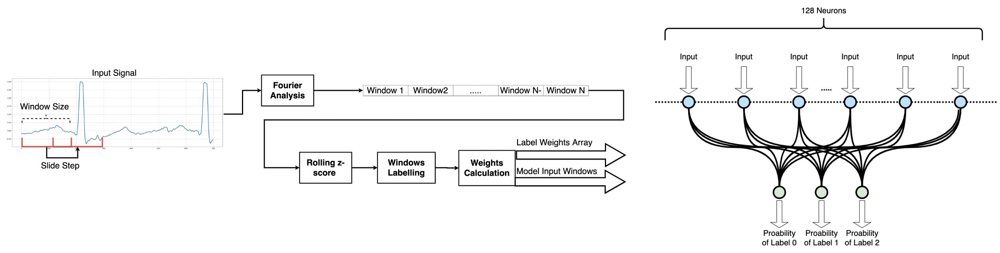
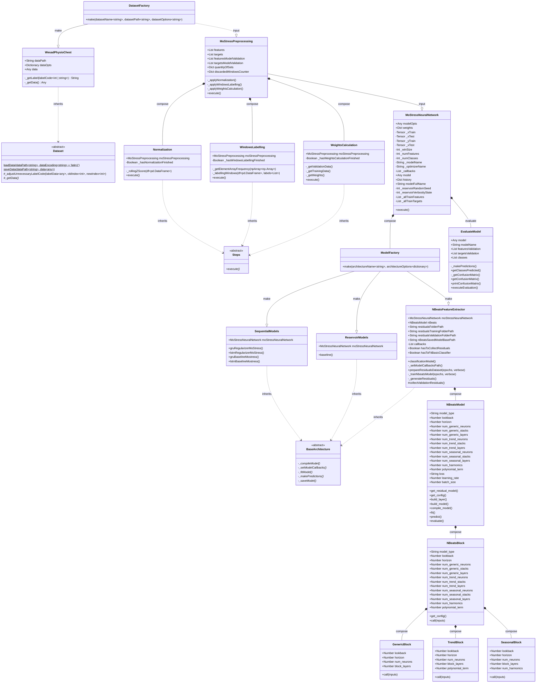

# README

* 1. [Introduction](#1-introduction)
* 2. [Prerequisites](#2-prerequisites)
* 3. [Datasets](#3-datasets)
* 4. [MoStress](#4-mostress)
  * 4.2 [Preprocessing Step](#41-preprocessing-step)
    * 4.2.1 [Config File](#411-config-file)
    * 4.2.2 [Implemented Steps](#412-implemented-steps)
  * 4.2 [Neural Network Architecture](#42-neural-network-architecture)
* 5. [Improvements](#5-improvements)
* 6. [Future Work](#6-future-work)
* 7. [Publications](#7-publications)
* [Appendix](#appendix)
  * A. [Code Architecture](#a-code-architecture)

## 1. Introduction

This is the implementation of MoStress: a sequence model for stress classification. For more information about the model itself and all the processes and experiments around it, please see the articles on [Publications](#7-publications) section . For more questions and discussions, please contact any of the authors of this repository.

The resume of MoStress is shown on the image and the diagram below below:




The code with the results can be found on folder ```main```, and the folder ```experiments``` we have testing of new features.

Also it is important to mention that this code it doesn't contain exploratory functions or methods, here is just the execution of MoStress.

Although , contributions to add those exploratory features or any other contribution are really welcome, please, create your fork, branch and pull request to add it!

## 2. Prerequisites

[](https://www.python.org/) [](https://pypi.org/) [](https://www.tensorflow.org/) [](https://scikit-learn.org/stable/) [](https://pandas.pydata.org/)
[](https://numpy.org/) [](https://github.com/reservoirpy/reservoirpy) [](https://pypi.org/project/keras-beats/) [](https://matplotlib.org/) [](https://seaborn.pydata.org/)

At this point in time, MoStress only support [WESAD dataset](https://dl.acm.org/doi/pdf/10.1145/3242969.3242985?casa_token=JPRVzf9hoRAAAAAA:paazllad7xmErtVz4Z5SvhMGKakLlQJCbooGm93uLZXpTvkcsAyzd5QR8071z3Coc8r6qq5EF6s6), therefore, in order to run the code successfully, it is important to obtain the WESAD data in advance.

## 3. Datasets

Right now, there is only the implementation of the physiologic data collected from chest sensor of the WESAD. Thus, to help deal with the possible configuration of different datasets, we use the json ```configs/wesadDatasetOptions.json``` to add custom configurations and if you want to add new datasets, we suggest to do the same.

If you need to add a new dataset, just create the class which implement it and add the class call on the ```datasets/DatasetFactory.py``` and also make your class inherit the abstract class ```datasets/Dataset.py``` and don't forget to implement the ```_getData()``` method.

## 4. MoStress

### 4.1 Building your setup

MoStress has a builder (**MoSB - MoStress Builder**), which can be used for setup preparation. Make sure you have the properly versions for Python, Pip, and Python-Env. With MoStress Builder, your environment is prepared automatically, installing the necessary libraries and creating directories. To run the builder, move to the root directory of the downloaded project and execute one of the following commands:

```
./builder
```

```
sh builder
```

```
bash builder
```

After preparing the environment, just run the environment according to the your operational system. Do not forget to make sure the environment created (```.mostress-env```) is being used by Jupyter or VSCode.

Linux/MacOS
```
source $PWD.mostress-env/bin/activate
```

### 4.2 Preprocessing Step

#### 4.2.1 Config File

On the folder configFiles, there is a ```configs/wesadDatasetOptions.json```, where we set all the parameters needed on the preprocessing.

#### 4.2.2 Implemented Steps

On ```moStress/preprocessing``` we have the main class ```MoStressPreprocessing.py```, which has the call for all the steps that has to be done.

Each step were implemented as classes on ```moStress/preprocessing/implementedSteps``` folder, and they all extends the abstract class: ```moStress/preprocessing/implementedSteps/Steps.py```, so if you want to implement a new step, please, inherit this class also.

### 4.3 Neural Network Architecture

The class ```MoStressNeuralNetwork``` basically is a wrapper which takes different models architecture, therefore, to add a new model, create a class which implements your architecture on ```models/architectures```, make your new architecture inherits of the abstract class ```models/architectures/BaseArchitecture.py```, and add the architecture call on ```models/architectures/ModelFactory.py```.

We also advice that you pass a instance of the class ```MoStressNeuralNetwork``` as the constructor of your new model, since this class may already have utils properties to your model.

Currently we have the follow architectures implemented:

* REGULARIZER-GRU,
* REGULARIZER-LSTM,
* BASELINE-GRU,
* BASELINE-LSTM,
* BASELINE-RESERVOIR
* NBEATS-FEATURE-EXTRACTOR

The regularizer prefix means that we add a Ridge Regularizer and a Max Norm Bias on the output layer of the sequential model.

Also, after we train the model, we save it on ```models/saved```

NOTE1: we don't save the reservoir model yet.

NOTE2: it is possible that the code of NBEATS-FEATURE-EXTRACTOR throw some error.

## 5 Improvements

1. Implement a resume report after the data preprocessing;
2. Implement the k-fold validation to improve the results;
3. Check if it is possible to lower the number of for loops;
4. Implement unit tests to ensure secure changes.

## 6. Future Work

1. Change the RNN for reservoir computing or spiking neural networks;
2. Use N-BEATS, with or without the preprocessing step.
3. Use MoStress with new datasets

## 7. Publications

Here is our publications:

1. A. de Souza, M. B. Melchiades, S. J. Rigo, G. d. O. Ramos, Mostress:
a sequence model for stress classification, in: 2022 International Joint
Conference on Neural Networks (IJCNN), IEEE, Padova, Italy, 2022,
pp. 1–8. doi:10.1109/IJCNN55064.2022.9892953. [Link](https://ieeexplore.ieee.org/document/9892953)

And here is how you can cite this research:

```bibtex
@INPROCEEDINGS{deSouza2022ijcnn,
  author={de Souza, Arturo and Melchiades, Mateus B. and Rigo, Sandro J. and Ramos, Gabriel de O.},
  title = {MoStress: a Sequence Model for Stress Classification},
  booktitle = {2022 International Joint Conference on Neural Networks (IJCNN)},
  year = {2022},
  address = {Padova, Italy},
  month = {July},
  publisher = {IEEE},
  pages={1-8},
  doi={10.1109/IJCNN55064.2022.9892953}
}
```

## Appendix

### A. Code Architecture



## License

This project uses the following license: [MIT](./LICENSE.md).
