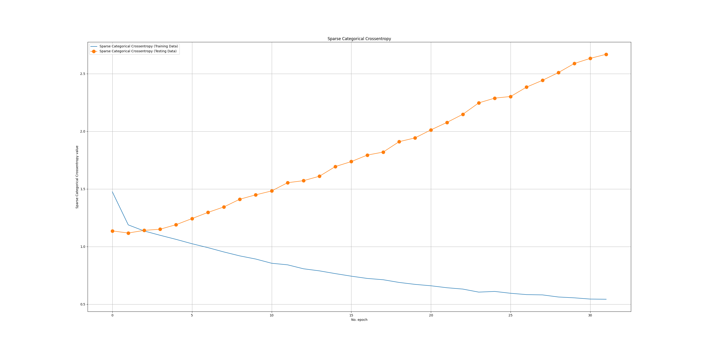
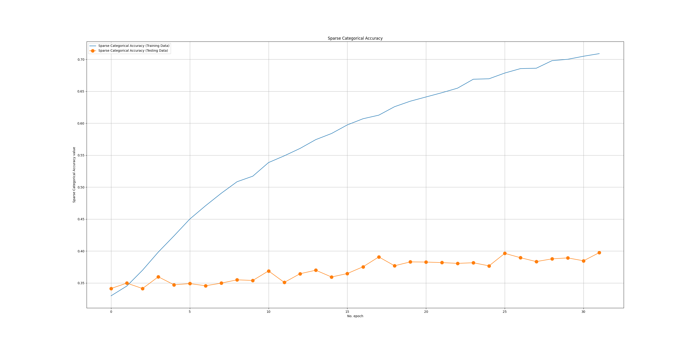
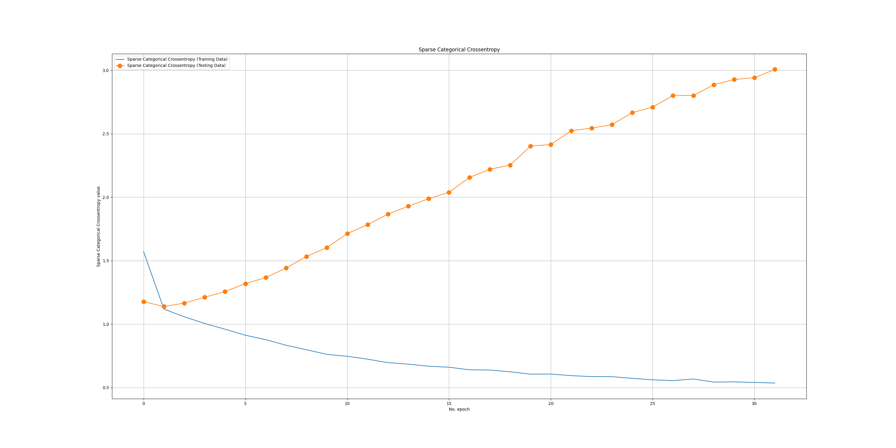
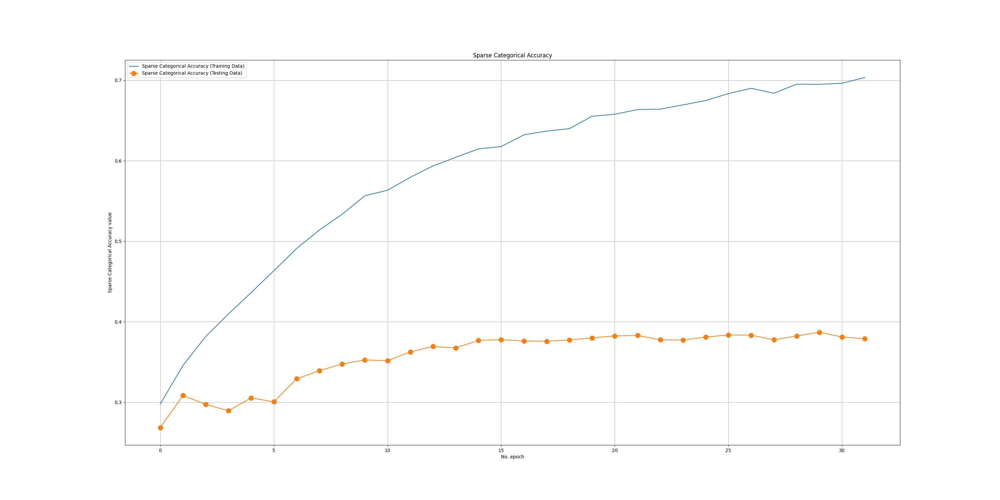
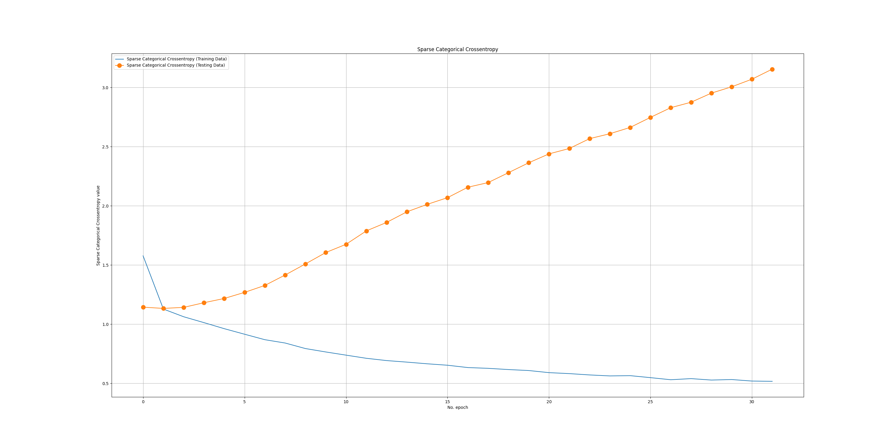
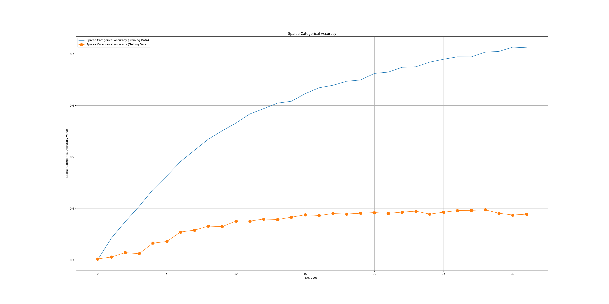
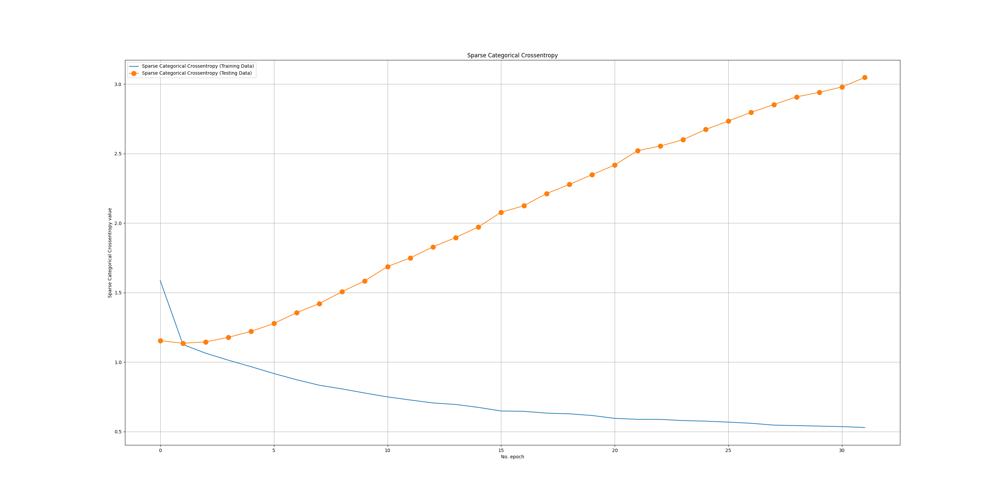
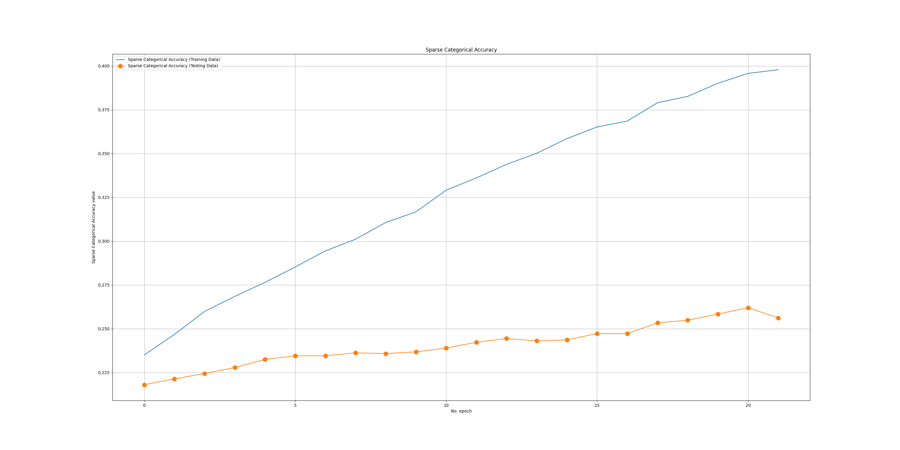

# Classification Report

```txt

                precision    recall  f1-score   support

    Baseline     0.5501    0.4420    0.4901      8016
      Stress     0.3138    0.3668    0.3382      4523
   Amusement     0.1670    0.2229    0.1909      2423

    accuracy                         0.3838     14962
   macro avg     0.3436    0.3439    0.3398     14962
weighted avg     0.4166    0.3838    0.3958     14962

```

# Confusion Matrix


# NLP Learning Curve

## Batch 1

| Sparse Categorical Cross Entropy      | Sparse Categorical Accuracy |
| ----------- | ----------- |
|       |        |

## Batch 2

| Sparse Categorical Cross Entropy      | Sparse Categorical Accuracy |
| ----------- | ----------- |
|       |        |

## Batch 3

| Sparse Categorical Cross Entropy      | Sparse Categorical Accuracy |
| ----------- | ----------- |
|       |        |

## Batch 4

| Sparse Categorical Cross Entropy      | Sparse Categorical Accuracy |
| ----------- | ----------- |
|       |        |