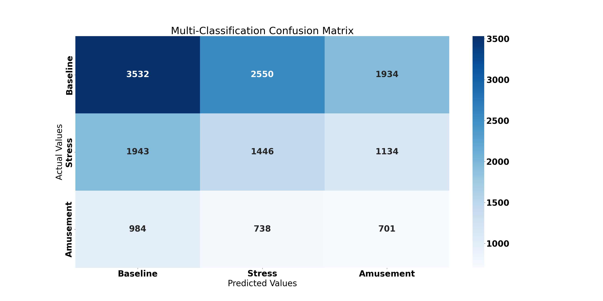
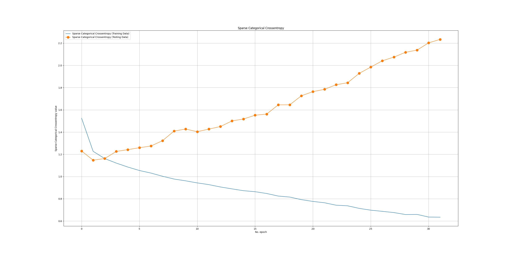
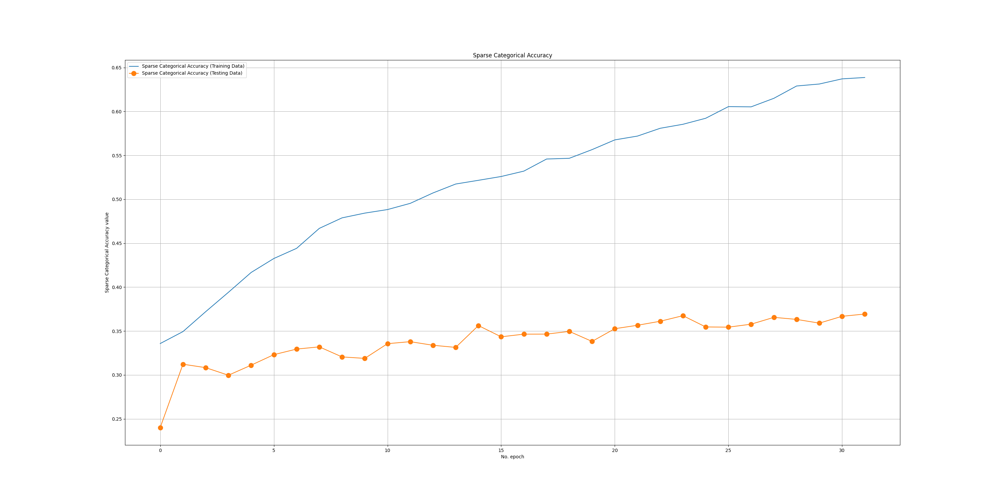
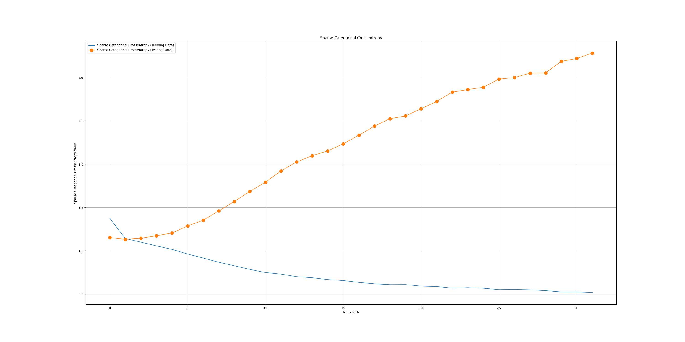
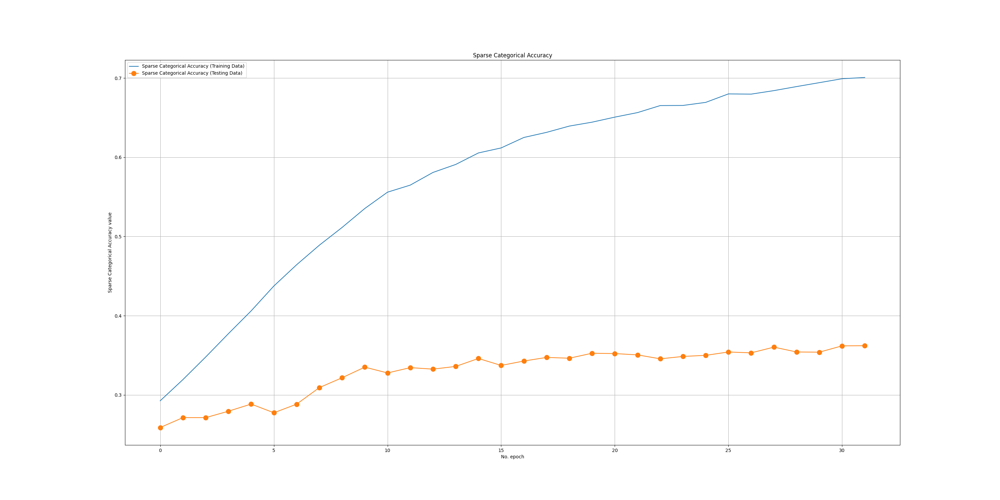
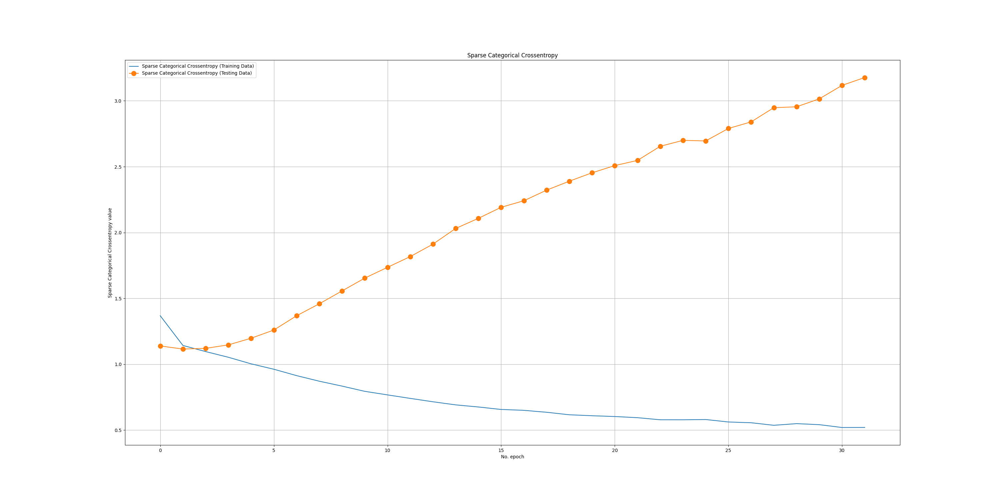
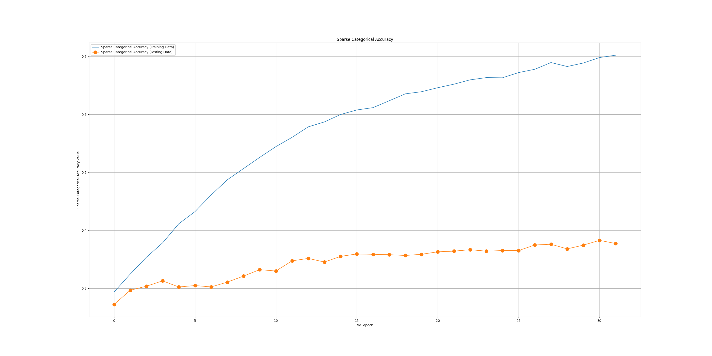
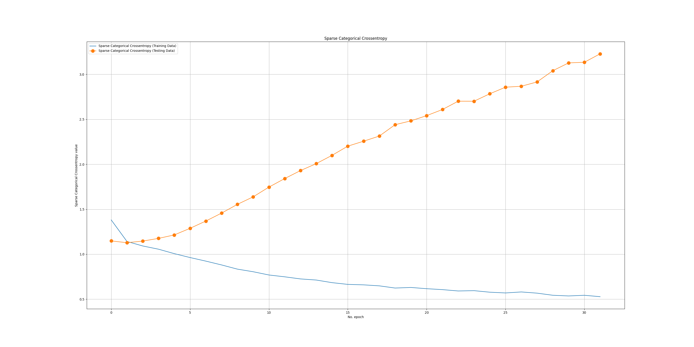
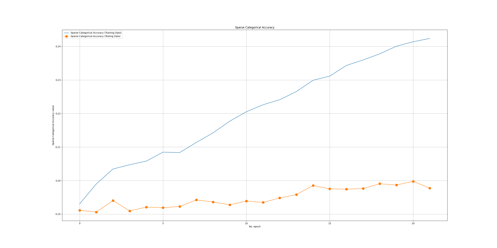

# Classification Report

```txt

                precision    recall  f1-score   support

    Baseline     0.5468    0.4406    0.4880      8016
      Stress     0.3054    0.3197    0.3124      4523
   Amusement     0.1860    0.2893    0.2264      2423

    accuracy                         0.3796     14962
   macro avg     0.3461    0.3499    0.3423     14962
weighted avg     0.4154    0.3796    0.3926     14962

```

# Confusion Matrix



# NLP Learning Curve

## Batch 1

| Sparse Categorical Cross Entropy      | Sparse Categorical Accuracy |
| ----------- | ----------- |
|       |        |

## Batch 2

| Sparse Categorical Cross Entropy      | Sparse Categorical Accuracy |
| ----------- | ----------- |
|       |        |

## Batch 3

| Sparse Categorical Cross Entropy      | Sparse Categorical Accuracy |
| ----------- | ----------- |
|       |        |

## Batch 4

| Sparse Categorical Cross Entropy      | Sparse Categorical Accuracy |
| ----------- | ----------- |
|       |        |