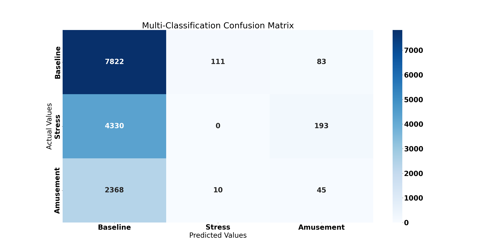
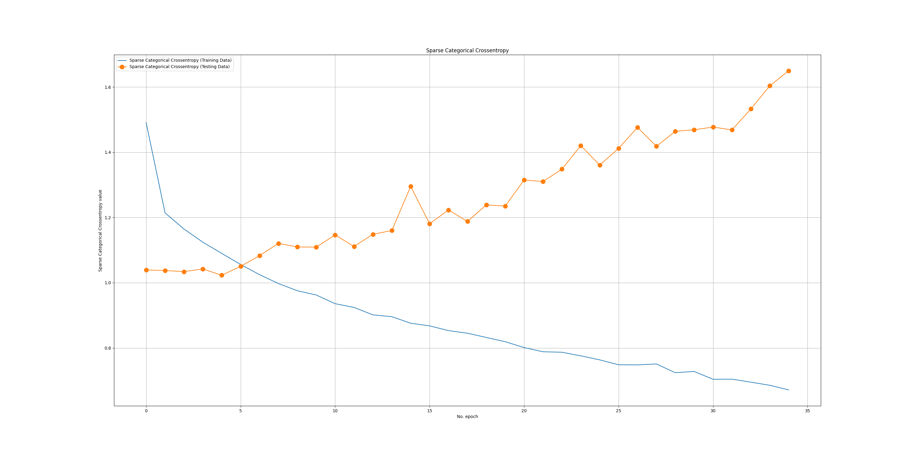
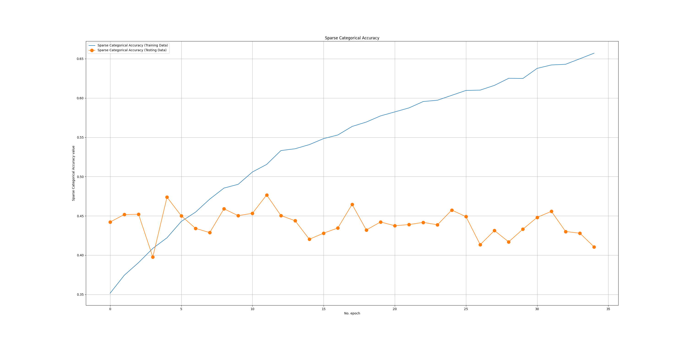
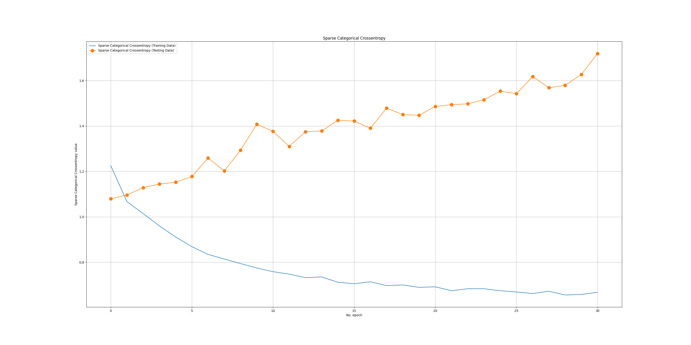
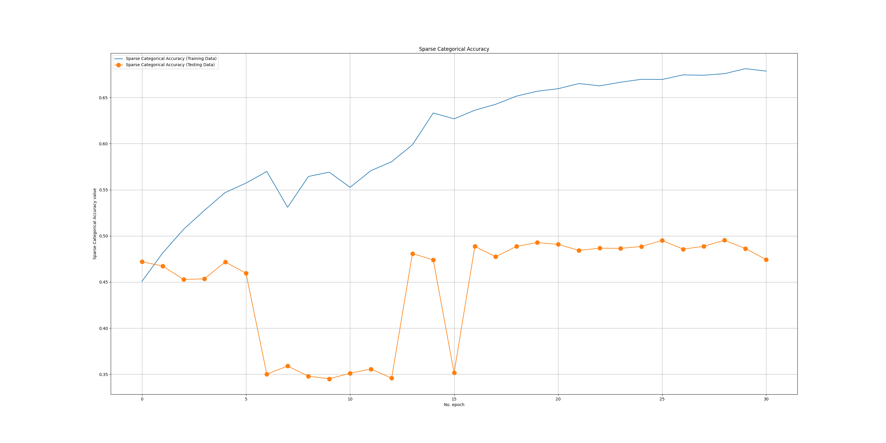
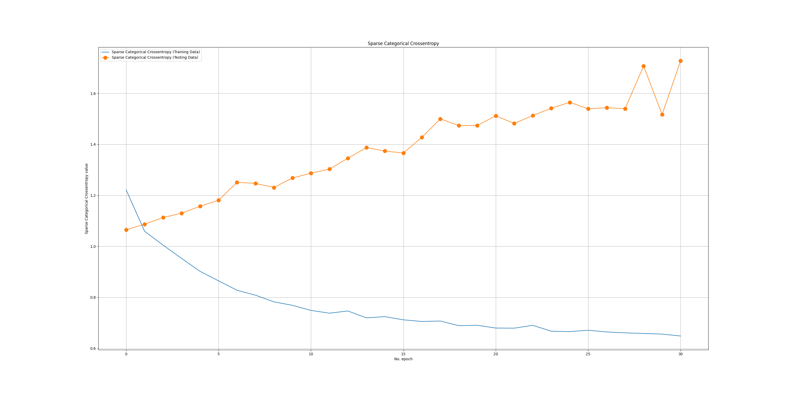
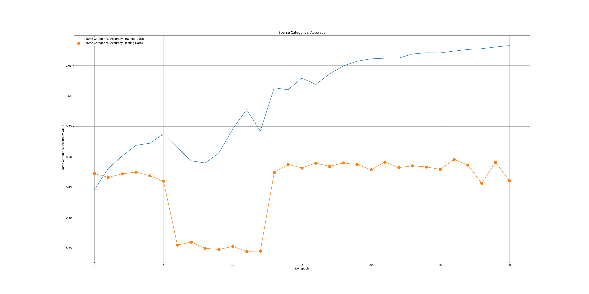
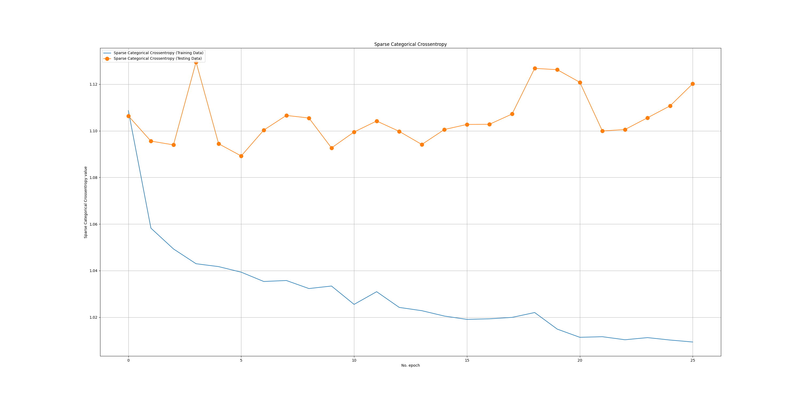
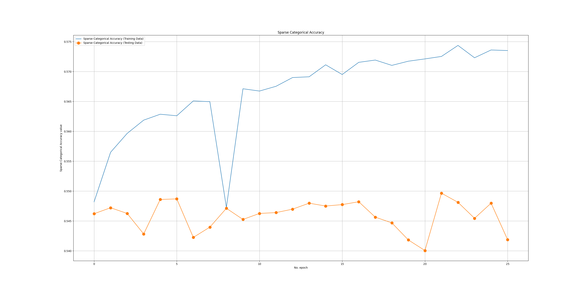

# Classification Report

```txt

                precision    recall  f1-score   support

    Baseline     0.5800    0.7486    0.6536      8016
      Stress     0.2525    0.1548    0.1919      4523
   Amusement     0.2013    0.1531    0.1739      2423

    accuracy                         0.4727     14962
   macro avg     0.3446    0.3522    0.3398     14962
weighted avg     0.4197    0.4727    0.4364     14962

```

# Confusion Matrix



# NLP Learning Curve

## Batch 1

| Sparse Categorical Cross Entropy      | Sparse Categorical Accuracy |
| ----------- | ----------- |
|       |        |

## Batch 2

| Sparse Categorical Cross Entropy      | Sparse Categorical Accuracy |
| ----------- | ----------- |
|       |        |

## Batch 3

| Sparse Categorical Cross Entropy      | Sparse Categorical Accuracy |
| ----------- | ----------- |
|       |        |

## Batch 4

| Sparse Categorical Cross Entropy      | Sparse Categorical Accuracy |
| ----------- | ----------- |
|       |        |