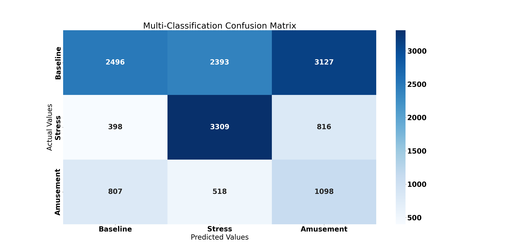
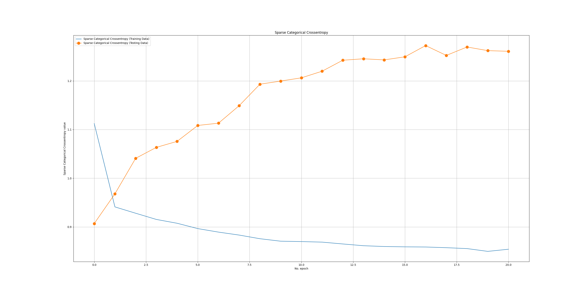
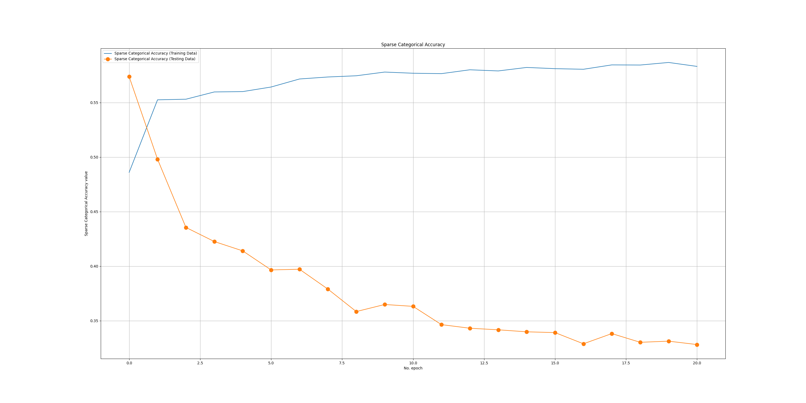
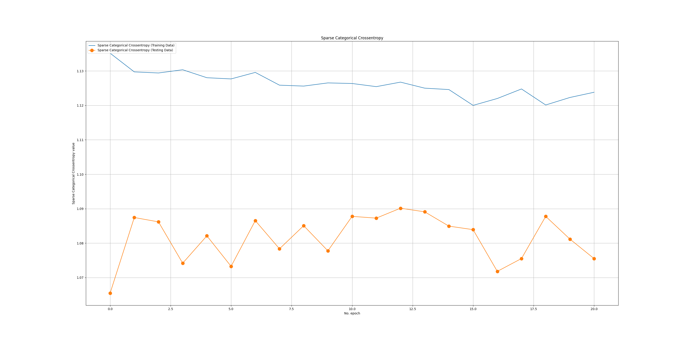
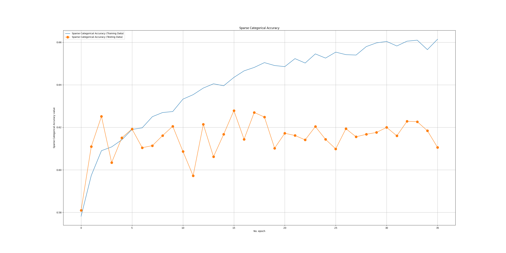
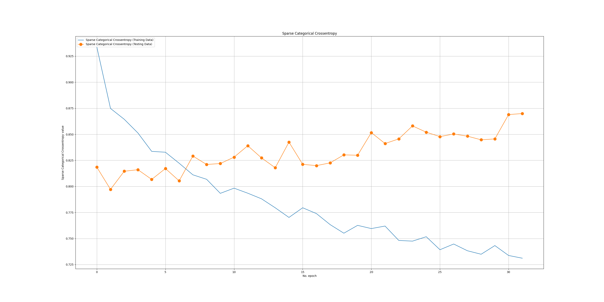
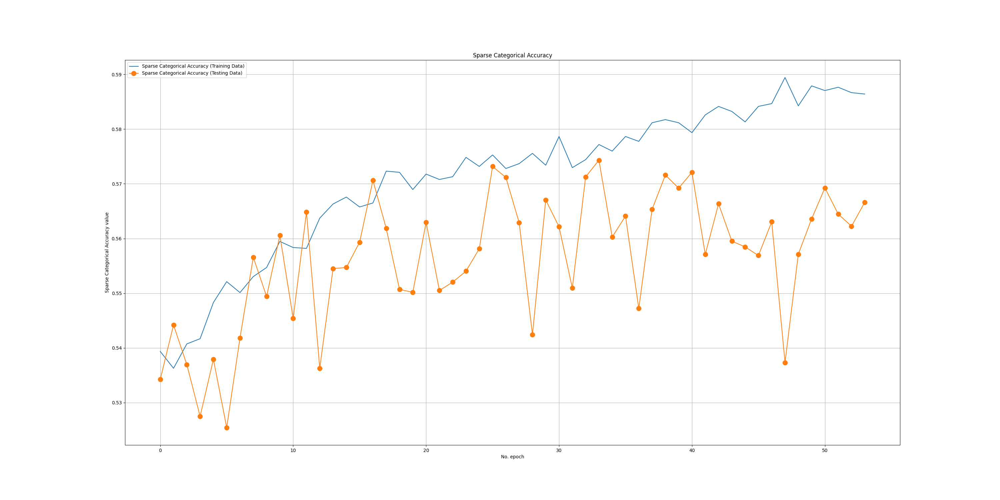
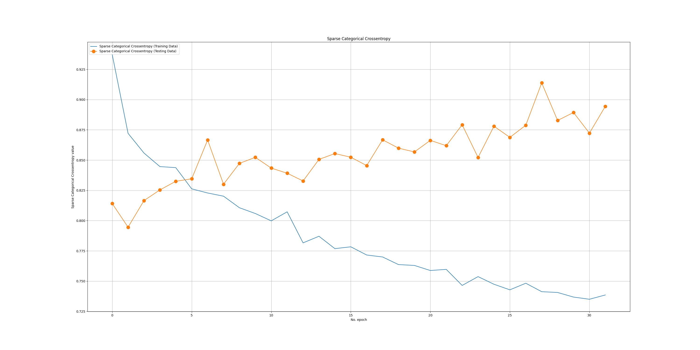
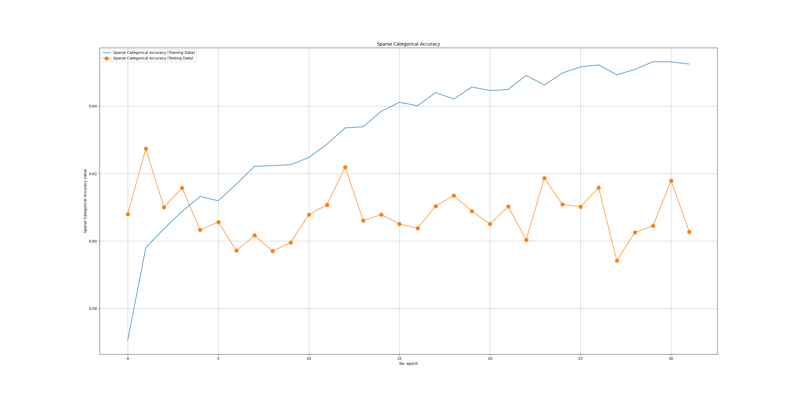

# Classification Report

```txt

               precision    recall  f1-score   support

    Baseline     0.6166    0.2378    0.3432      8016
      Stress     0.5205    0.7787    0.6239      4523
   Amusement     0.2040    0.4296    0.2766      2423

    accuracy                         0.4324     14962
   macro avg     0.4470    0.4820    0.4146     14962
weighted avg     0.5207    0.4324    0.4173     14962

```

# Confusion Matrix



# NLP Learning Curve

## Batch 1

| Sparse Categorical Cross Entropy      | Sparse Categorical Accuracy |
| ----------- | ----------- |
|       |        |

## Batch 2

| Sparse Categorical Cross Entropy      | Sparse Categorical Accuracy |
| ----------- | ----------- |
|       |        |

## Batch 3

| Sparse Categorical Cross Entropy      | Sparse Categorical Accuracy |
| ----------- | ----------- |
|       |        |

## Batch 4

| Sparse Categorical Cross Entropy      | Sparse Categorical Accuracy |
| ----------- | ----------- |
|       |        |