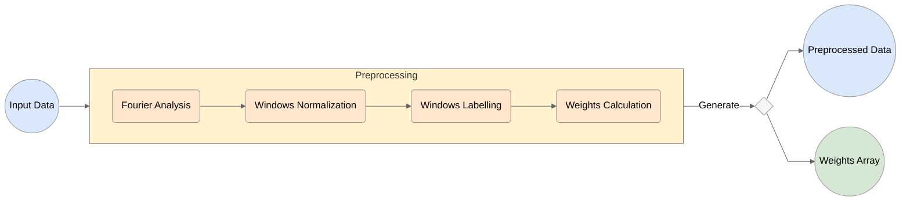
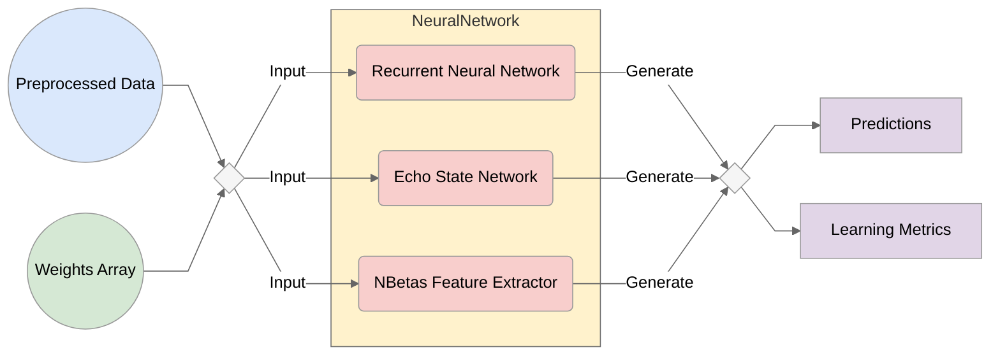

```mermaid

    flowchart LR

        %%{init: {'flowchart' : {'curve' : 'linear'}}}%%
        %%{init: {'theme':'neutral'}}%%

        classDef circles fill:#DAE8FC
        classDef circlesGreen fill:#D5E8D4
        classDef subgraphBackground fill:#FFF2CC
        classDef roundRectangles fill:#FFE6CC
        classDef ifs fill:#F5F5F5

        inputData((Input Data)):::circles
        preprocessedData((Preprocessed Data)):::circles
        weightsArray((Weights Array)):::circlesGreen
        if{" "}:::ifs

        Preprocessing:::subgraphBackground

        subgraph Preprocessing
            direction LR  

            fourier(Fourier Analysis):::roundRectangles
            normalization(Windows Normalization):::roundRectangles
            label(Windows Labelling):::roundRectangles
            weights(Weights Calculation):::roundRectangles

            fourier --> normalization --> label --> weights

        end


        inputData --> Preprocessing
        Preprocessing -->|Generate| if
        if --> preprocessedData
        if --> weightsArray
```

```mermaid
    flowchart LR

    %%{init: {'flowchart' : {'curve' : 'linear'}}}%%
    %%{init: {'theme':'neutral'}}%%

    classDef circles fill:#DAE8FC
    classDef circlesGreen fill:#D5E8D4
    classDef rectangle fill:#E1D5E7
    classDef subgraphBackground fill:#FFF2CC
    classDef roundRectangles fill:#F8CECC
    classDef ifs fill:#F5F5F5

    preprocessedData1((Preprocessed Data)):::circles
    weightsArray((Weights Array)):::circlesGreen
    if{" "}:::ifs
    if2{" "}:::ifs
    prediction[Predictions]:::rectangle
    metrics[Learning Metrics]:::rectangle

    preprocessedData1 --> if
    weightsArray --> if

    NeuralNetwork:::subgraphBackground

    subgraph NeuralNetwork

            rnn("Recurrent Neural Network"):::roundRectangles
            esn(Echo State Network):::roundRectangles
            nbeats(NBetas Feature Extractor):::roundRectangles

        end

    if -->|Input| rnn
    if -->|Input| esn
    if -->|Input| nbeats

    rnn -->|Generate| if2
    esn -->|Generate| if2
    nbeats -->|Generate| if2

    if2 --> prediction
    if2 --> metrics
```
