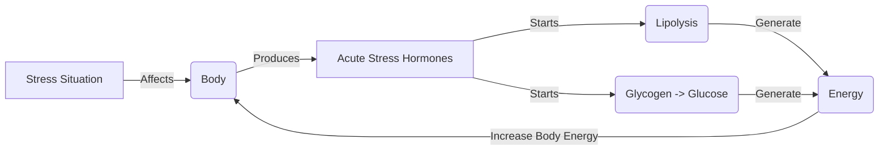
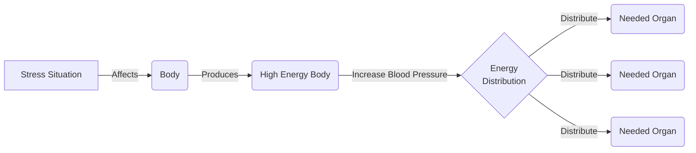

# Stress Organism Diagram

```mermaid
    graph LR

        stressSituation[Stress Situation]
        body(Body)

        stressHormones[Acute Stress Hormones]

        lipolysis(Lipolysis)
        energyConversion(Glycogen -> Glucose)
        energy(Energy)

        stressSituation --> |Affects| body
        body --> |Produces| stressHormones
        stressHormones --> |Starts| lipolysis
        stressHormones --> |Starts| energyConversion
        lipolysis --> |Generate| energy
        energyConversion --> |Generate| energy
        energy --> |Increase Body Energy| body

```

```mermaid
    graph LR

        stressSituation[Stress Situation]
        body(Body)
        highEnergyBody(High Energy Body)
        energyDistribution{Energy <br/> Distribution}
        neededOrgan1(Needed Organ)
        neededOrgan2(Needed Organ)
        neededOrgan3(Needed Organ)

        stressSituation --> |Affects| body
        body --> |Produces| highEnergyBody
        highEnergyBody --> |Increase Blood Pressure| energyDistribution
        energyDistribution --> |Distribute| neededOrgan1
        energyDistribution --> |Distribute| neededOrgan2
        energyDistribution --> |Distribute| neededOrgan3

```
